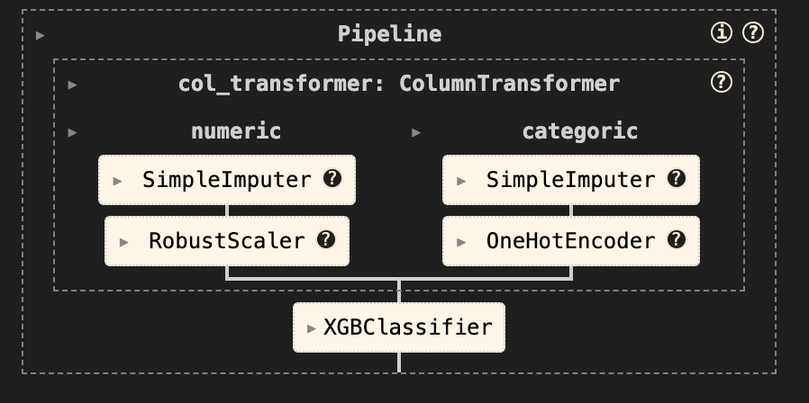

# Presentación

Hola! Este es el repositorio para el proyecto del curso MLOps de la Universidad Adolfo Ibáñez.

## Problema a resolver 🍺

Utilizando información histórica de ventas de una importante productora de bebidas del país, se propone desarrollar un modelo predictivo que estime la **probabilidad de compra de la próxima semana** de **cada producto** del portafolio para **cada cliente** activo.

  

## Datos disponibles 📊

Los datos disponibles provienen desde diferentes fuentes, entre las que encontramos:

- **Datos transaccionales**: contiene el historial de compras realizadas por los clientes.
	- `customer_id`: identificador único del cliente que realizó la compra.
	- `product_id`: identificador único del producto comprado.
	- `purchase_date`: fecha en que se realizó la transacción.

- **Datos de clientes**: incluye las características de cada cliente.
	- `customer_id`: identificador único del cliente.
	- `region_id`: identificador de la región geográfica donde se encuentra el cliente.
	- `customer_type`: tipo de cliente según el canal comercial, por ejemplo, “TIENDA DE CONVENIENCIA”.
	- `Y`: coordenada geográfica de latitud.
	- `X`: coordenada geográfica de longitud.
	- `num_deliver_per_week`: cantidad de entregas semanales que recibe el cliente.
	- `num_visit_per_week`: frecuencia de visitas de la fuerza de ventas por semana.

- **Datos de productos**: describe las características de los productos del portafolio.
	- `product_id`: identificador único del producto.
	- `brand`: marca comercial del producto.
	- `category`: categoría general del producto, como “BEBIDAS CARBONATADAS”.
	- `sub_category`: subcategoría dentro de la categoría principal, por ejemplo, “GASEOSAS”.
	- `segment`: segmento de mercado al que pertenece el producto, como “PREMIUM”.
	- `package`: tipo de envase del producto.
	- `size`: tamaño del producto en litros.

## Solución propuesta ✅

Para resolver el problema se utilizó un modelo `XGBoost`, el cual es un modelo basado en árboles de decisión que destaca por su capacidad de predicción para resolver problemas de aprendizaje supervisado con datos tabulares. El pipeline de ML puede ser resumido en las siguiente figura:

**Nota importante:** Para este proyecto asumiremos el modelo fue entrenado y exportado en una etapa previa al proyecto, siendo este contenido en `model.pkl`.

  

## Arquitectura de MLOps ⚙️

Una vez con el modelo entrenado, se desarrolla código para la integración y despliegue continuo de la solución (CI/CD). Para esto, se utilizan las siguientes herramientas y tecnologías:

- `FastAPI`: Nos permite levantar una API para hacer consultas al modelo entrenado.
- `Docker`: Nos permite levantar la API en un contenedor mediante la construcción de *imágenes*, facilitando el empaquetamiento de la solución.
- `Github Repositories`: Nos facilita el almacenamiento y versionamiento de nuestro código en un repositorio remoto.
- `Github Actions`: Nos habilita la ejecución de pipelines de procesamiento en el repositorio remoto, los que generalmente son usados para orquestas el CI/CD.
- `DockerHub`: Plataforma que habilita el almacenamiento de la imagen de la aplicación, comúnmente llamado *Container Registry*.
- `Microsoft Azure Container Apps`: Servicio cloud que nos permite *hostear* la aplicación.

## Contacto ✉️

Eso es todo! Cualquier duda o comentario en relación al proyecto, no duden en escribirme a mi correo: stinoco@fen.uchile.cl nos vemos!! 🤗

  

